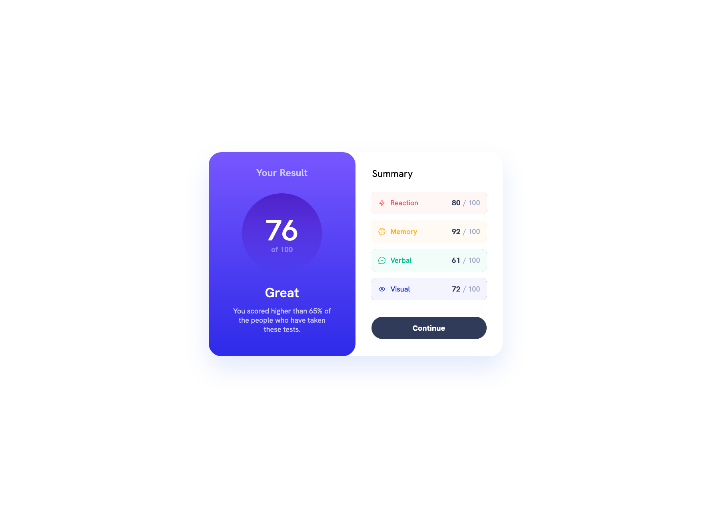

This is a solution to the [Results summary component challenge on Frontend Mentor](https://www.frontendmentor.io/challenges/results-summary-component-CE_K6s0maV).

## Table of contents

- [Overview](#overview)
  - [The challenge](#the-challenge)
  - [Screenshot](#screenshot)
  - [Links](#links)
- [My process](#my-process)
  - [Built with](#built-with)
- [Author](#author)

### The challenge

Users should be able to:

- View the optimal layout for the interface depending on their device's screen size
- See hover and focus states for all interactive elements on the page

### Screenshot

[//]: # (### Links)
[//]: # (- Solution URL: [Add solution URL here]&#40;https://your-solution-url.com&#41;)
[//]: # (- Live Site URL: [Add live site URL here]&#40;https://your-live-site-url.com&#41;)

### Built with

- Semantic HTML5 markup
- CSS custom properties
- Flexbox
- CSS Grid
- Mobile-first workflow
- Gulp

## Author

- Frontend Mentor - [@yourusername](https://www.frontendmentor.io/profile/skarakash)
- Twitter - [@yourusername](https://www.twitter.com/serg_ka)

